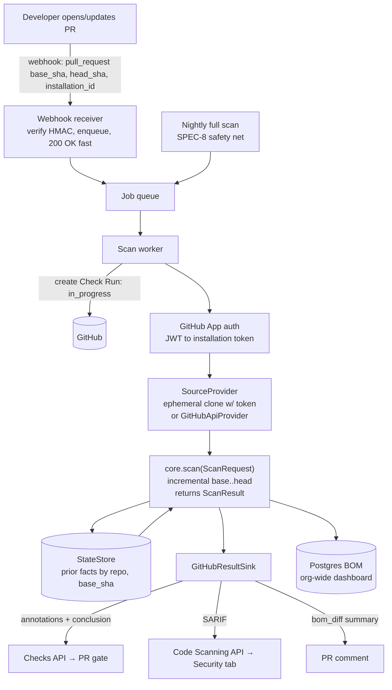

# SPEC_GITHUB — aiscan as a GitHub-integrated SDLC scanner

**Status:** planned · **Depends on:** SPEC-10 (embeddable core + pluggable source & storage seams)
**Goal:** run aiscan automatically on every PR/push like a bank-grade SDLC scanner (CodeQL / Snyk /
Checkmarx-style), surface results **inside GitHub** (PR Checks + inline annotations, the Security
"Code scanning" tab, a PR summary comment), gate merges on policy, and feed a central org-wide
AI-BOM dashboard — **without changing the analysis engine**.

The engine and its seams are done (SPEC-10). This spec is the GitHub-specific *shell* around them:
an auth + webhook + queue front end, a result sink that speaks GitHub's APIs, and production
storage. Every piece below drops into an interface that already exists.

## What already exists (do not rebuild)

| Capability | Seam / file |
|---|---|
| Scan engine, no disk, returns objects | `core.scan(ScanRequest) → ScanResult` — `aiscan/core.py` |
| Ephemeral per-scan source fetch | `fetch_source` / `_clone_ephemeral` — `aiscan/ingest/git.py` |
| Incremental PR diff (`base..head`) | SOON-8/10-I + `changed_files` + `StateStore.get_prior_facts` |
| Persist state by `(repo, commit)` | `StateStore` protocol — `aiscan/store.py` (`LocalDirStore` default) |
| "What did this PR change" | `bom_diff(base, head)` — `aiscan/dataset/store.py` |
| Org-wide queryable BOM | write-through SQLite — `aiscan/dataset/store.py` (→ Postgres backend) |
| Per-tenant credential injection | `ScanRequest.llm_api_key` (core never reads env) |
| Concurrency-safe (N scans/process) | per-scan logger, no global mutable state |
| Machine-readable contract | `record.schema.json` + `Record.schema_version` |
| Pluggable read view of the tree | `Source` / `LocalDirSource` — `aiscan/ingest/source.py` |

The SPEC-10 end-to-end test (`tests/test_service_flow.py`) already simulates the worker loop —
fetch two commits → incremental → `bom_diff` — minus the GitHub API calls this spec adds.

## The GitHub surfaces (how results appear in GitHub)

| Surface | What is seen | GitHub API | Audience |
|---|---|---|---|
| **Check Run** | live `aiscan` entry in the PR **Checks** tab (`queued → in_progress → success/failure`) with **inline annotations** at each finding's file:line; a **required** check blocks merge | Checks API | developers (the gate) |
| **Code scanning** | findings in **Security → Code scanning**, org-wide, with triage/dismiss workflow — where CodeQL/Snyk/Checkmarx land | Code Scanning API (SARIF upload) | security/governance |
| **PR comment** | human summary: "🤖 AI-BOM changed: +1 agent (Analytics · gpt-4o · moves_money)" | Issues/PR comments API | reviewers |
| **Dashboard** | every AI system across the estate | your web app over the BOM DB | risk/compliance |

aiscan findings (`FindingRecord`: `kind`, `evidence` file:line, `severity`, `detail`) map directly
onto SARIF `results` and Check annotations — that is why the fit is clean.

## Target architecture

## Invariants (must hold)

- **Static only, no code execution; deterministic per commit** — unchanged from the engine.
- **No data egress by default** — the only network calls are `git`/GitHub API and the (optional,
  opt-in) LLM tiers, which point at a client-approved endpoint (`base_url` → internal gateway).
  Source code never leaves the perimeter unless a tier is explicitly enabled against an approved URL.
- **Per-installation / per-tenant isolation** — every scan carries its own GitHub installation token
  and its own LLM key on the `ScanRequest`; the core reads no process/global credentials (SPEC-10 §4).
- **Fail safe, not fast** — a scan error posts a `neutral` (non-blocking) Check with the reason, never
  a false `success`; a missing base fact-set escalates to a full scan (SPEC-8).
- **Secrets never logged or written to any artifact** — App private key + tokens + LLM keys live in a
  vault; tokens are short-lived (~1 h) and minted per fetch.

## Components to build

### A. GitHub App + auth adapter
- Register a GitHub App. Permissions: `Contents: read`, `Metadata: read`, `Checks: write`,
  `Pull requests: write`, `Code scanning alerts: write`. Webhook events: `pull_request`
  (opened/synchronize/reopened), `push`, `installation`, `installation_repositories`.
- Auth flow: sign an **App JWT** with the private key → exchange for a short-lived **installation
  access token** (`POST /app/installations/{id}/access_tokens`, ~1 h, scoped to that install's repos).
- New: `aiscan/github/auth.py` — `installation_token(app_id, private_key, installation_id) -> str`.
- Wire into the provider: `_clone_ephemeral` clones `https://x-access-token:<token>@github.com/{owner}/{repo}.git`
  (a small optional-token parameter on the existing function).

### B. Webhook receiver
- A small HTTP service (FastAPI): verify `X-Hub-Signature-256` HMAC, parse the event, **enqueue**
  `{owner, repo, base_sha, head_sha, installation_id, pr_number}`, return 200 within seconds.
- Never scan inline (scans take minutes). PR base = `pull_request.base.sha`; head = `.head.sha`.
- New: `aiscan/github/webhook.py`.

### C. Queue + worker pool
- Redis/SQS/Celery (pick per deployment). Workers pull jobs and run the scan loop. The concurrency
  cap is the scaling knob; the core is already safe to run N-at-once in one process (SPEC-10 §4).
- New: `aiscan/github/worker.py` — the loop: create Check → fetch → `core.scan` → persist → render.

### D. `GitHubResultSink` (the reporting layer — the highest-value new code)
Three renderers over a `ScanResult`:
- **SARIF exporter** — `aiscan/report/sarif.py`: each `FindingRecord` → a SARIF 2.1.0 `result`
  (`ruleId` = finding kind, `level` from severity, `locations[].physicalLocation.artifactLocation.uri`
  + `region.startLine/endLine` parsed from the `file:line` evidence). Rules go in
  `runs[].tool.driver.rules[]`. Upload gzip+base64 to `POST /repos/{o}/{r}/code-scanning/sarifs`
  (`commit_sha`, `ref`). **This single artifact is what makes aiscan "a real scanner" in GitHub.**
- **Check Run renderer** — `aiscan/github/checks.py`: create `in_progress` at start; complete with a
  `conclusion` (from the policy engine) + `output.title/summary/annotations[]` (path/start_line/
  end_line/annotation_level/message, batched ≤50 per request).
- **PR comment** — `bom_diff(base, head)` → a concise markdown summary; upsert one comment per PR
  (find-and-update, don't spam).

### E. Production `StateStore` backend
- Implement the existing `StateStore` protocol against **Postgres** (the `(repo, commit)` BOM index
  + carried facts) and an **object store** (record.json / graph.json / artifacts). Pure backend swap —
  the pipeline is untouched. New: `aiscan/store_pg.py` (or a `stores/` package).
- The write-through dataset (`dataset/store.py`) points at the same Postgres instead of a local
  SQLite file; the flatten schema (systems/agents/tools/models/findings/mcp_servers/model_usages)
  is already the dashboard's data model.

### F. Policy engine
- Rules that turn the BOM + findings into a Check **conclusion** (e.g. *"block a PR that introduces an
  agent with `moves_money` and no approval record"*, *"warn on a new unapproved gateway host"*).
- New: `aiscan/github/policy.py` — `evaluate(record, bom_diff) -> Conclusion + [violations]`.
- Enforced via **branch protection → required status check** so a failing policy blocks merge.

### G. `GitHubApiProvider` (optional; the deferred SPEC-10 §H tail)
- A `SourceProvider` that fetches tree/blobs via the GitHub API (no clone), plus the four remaining
  VFS readers (`run_triage`, `read_ts_config`, `collect_env_defaults`, `find_declared_agents`).
- **Only build if per-scan clone cost dominates at org scale** — the ephemeral blobless clone already
  works and is often preferred (full git history for provenance, air-gap friendly).

### H. Governance dashboard
- A web app over the Postgres BOM tables (already produced by `flatten`) — the estate-wide AI
  inventory, AIA risk tiering, owner/lifecycle/approval fields. Reads only; the scanner writes.

### I. Scheduled full scans
- A cron that enqueues a `--full` scan of every installed repo nightly (SPEC-8 safety net): incremental
  drift self-heals within a day, and repos with no recent PRs still get inventoried.

## Phased build plan

- **Phase 0 — MVP, zero hosting: a GitHub Action.** Package aiscan as an Action; the customer adds a
  `.github/workflows/aiscan.yml` on `pull_request`; it scans the already-checked-out repo, writes
  SARIF, and uploads via `github/codeql-action/upload-sarif` (or the REST API). **You are "in GitHub"
  (Checks + Security tab) with no backend.** Deliverables: `report/sarif.py` + `action.yml`. Air-gap /
  GHES friendly, and what most teams ship first.
- **Phase 1 — GitHub App + webhook + one worker + Check Runs.** Automatic and centralized; single
  worker, `LocalDirStore` on a volume. Proves the live loop and the merge gate. Deliverables: A, B,
  a minimal C (one worker), D (Checks + SARIF).
- **Phase 2 — Queue + worker pool + Postgres store + dashboard.** Scale + the org-wide inventory.
  Deliverables: full C, E, H.
- **Phase 3 — Policy-as-required-check + nightly full scans + (optional) GitHubApiProvider.** The full
  bank-grade gate + governance. Deliverables: F, I, optionally G.

## Deployment notes (bank / GitHub Enterprise Server)

- **Self-hosted / GHES**: the App / Checks / Code-scanning / SARIF APIs all exist on GHES. Run the
  receiver + workers inside the bank's network (often on self-hosted runners for air-gap). The LLM
  tiers already target an internal gateway via `base_url` — no source or prompt leaves the perimeter.
- **Secrets**: App private key + LLM keys in a vault (Vault/KMS), not `.env`. The core is already
  credential-injectable, so this is config, not code.
- **Two audiences, two surfaces**: developers get the **PR gate** (Checks, block-on-policy); risk/
  compliance get the **Security tab + dashboard** (org-wide AI-BOM, AIA tiering, bank inventory fields).

## Verification

- **SARIF validity** — schema-validate emitted SARIF (2.1.0); a golden fixture (findings → SARIF)
  compared byte-stable, same discipline as the record goldens.
- **Auth** — installation-token minting + HMAC signature verification unit-tested with recorded
  fixtures (no live GitHub).
- **Worker loop** — extend `tests/test_service_flow.py`: the same two-commit ephemeral+incremental
  flow, asserting the SARIF/Check/PR-comment payloads (against a mocked GitHub client) and that a
  policy violation yields a `failure` conclusion.
- **No egress** — assert the core makes zero network calls on the default (no-LLM-tier) path.
- **Idempotency** — replaying the same webhook (`synchronize` on an unchanged head) upserts, never
  duplicates (the `(repo, commit)` store + idempotent scan-id already guarantee this).
